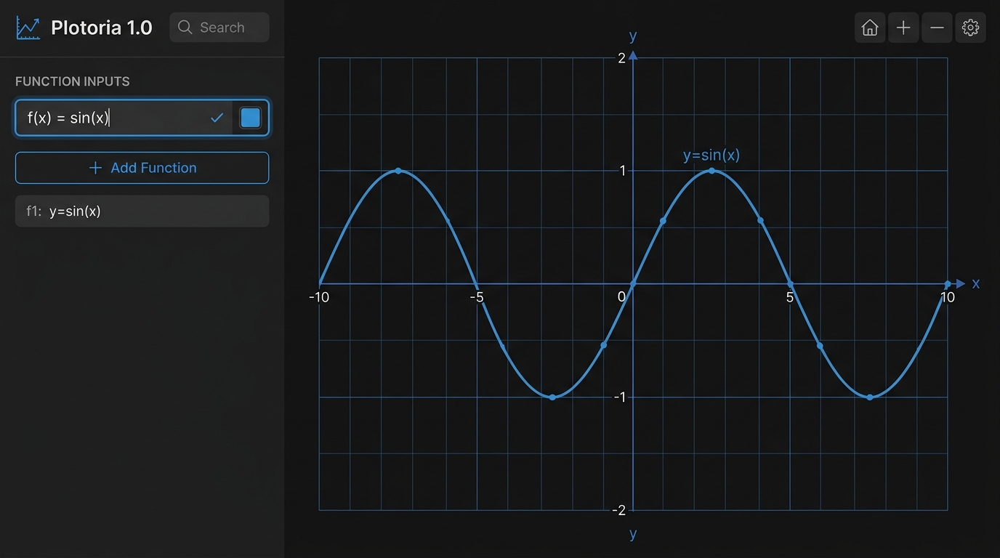

# 🤖 KI-Entwicklung & Antigravity Collaboration

Dieses Projekt **Plotoria** wurde in enger Zusammenarbeit zwischen **Tobias Schmidbauer** (Projektleiter & Entwickler) und **Google Antigravity AI** (Advanced Agentic Coding Team bei Google DeepMind) entwickelt.

---

## 🏛️ Architektur & Entwicklungsansatz

Plotoria kombiniert moderne Webtechnologien mit agentischer KI-Unterstützung:

* **Mensch-KI Pair Programming:** Konzept, Anforderungen und didaktische Design-Entscheidungen stammen von Tobias Schmidbauer. Die Implementierung, Refactorings, Performance-Optimierungen und mathematischen Bibliotheks-Integrationen wurden agentisch durch Google Antigravity umgesetzt.
* **Agentische Workflows:** Einsatz von spezialisierten Subagenten, automatisiertem Refactoring, Fast-Compilation-Engines und interaktiver Git-Branch-Verwaltung.

---

## 🚀 Entwicklungsschritte (Version 1.0 zu Version 2.0)

### 📌 Version 1.0 (Basis-Plotter)
* Aufbau eines maßgeschneiderten SVG-Rendering-Core mit D3.js.
* Grundlegende Plot-Funktionalität für mathematische Funktionen.
* Deutsches Koordinatensystem mit Pfeilachsen und Raster.

### 📌 Version 2.0 (AI-Enhanced Antigravity Release)
* **Mathematische Präzision & Fast Compilation:** Fast JS Compilation über `nerdamer.buildFunction()`, welche die Auswertung um das 100-fache beschleunigt und 60 FPS Zoomen/Verschieben ermöglicht.
* **KaTeX Formelsatz:** Wunderschöne mathematische Formeldarstellung im Algebra-Panel.
* **Erweiterte Kurvendiskussion:** Automatische Berechnung von Nullstellen $N$, Y-Achsenabschnitten $S_y$, Extrema $Max/Min$, Wendepunkten $W$ ($f''(x)=0$) und Schnittpunkten $S$.
* **Hardware-beschleunigtes Drag & Drop:** Frei verschiebbare Smart Labels mit dynamischen Verbindungslinien.
* **Interaktive Wertetabelle & CSV-Export:** Dynamische Tabellenansicht mit anpassbarem Intervall.
* **RAD / DEG Umschaltung:** Unterstützung für Bogen- und Gradmaß bei trigonometrischen Funktionen.
* **Exporte:** PNG, Clipboard, SVG, TikZ/LaTeX und URL-State-Sharing.

---

## 👨‍💻 Mitwirkende

* **Tobias Schmidbauer** – Idee, Architektur, didaktische Ausrichtung & Projektleitung
* **Google Antigravity AI** – Autonomous Coding Agent & Performance Optimization (Google DeepMind)
