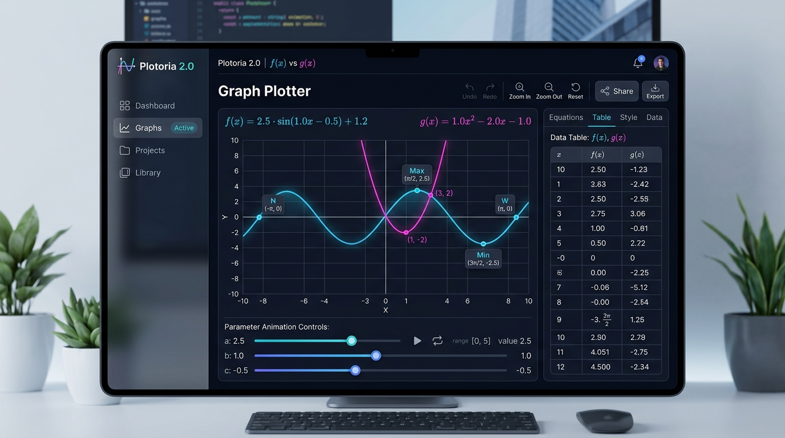

# 📘 Plotoria – Vollständige Bedienungsanleitung

Willkommen zur offiziellen Benutzeranleitung von **Plotoria**, dem modernen, browserbasierten Funktionsplotter für Schule, Studium und Wissenschaft.

---

## 🚀 Quick-Start

1. Öffne Plotoria im Browser (z. B. unter [http://localhost:8080](http://localhost:8080) oder auf GitHub Pages).
2. Gib in der Algebra-Spalte oben im Eingabefeld eine Funktion ein, z. B. `x^2 - 4` oder `f(x) = sin(x)`.
3. Drücke **Enter** oder klicke auf das **+ (Hinzufügen)**.
4. Der Graph wird sofort mit flüssigen 60 FPS gezeichnet.

---

## 🧮 1. Funktionen eingeben & verwalten

### Unterstützte Schreibweisen
* Standard-Ausdrücke: `x^3 - 2*x`, `1/x`, `exp(-x^2)`
* Funktionsnamen: `f(x) = sin(x)`, `g(x) = 2*x + 1`
* Mathematische Funktionen: `sin(x)`, `cos(x)`, `tan(x)`, `sqrt(x)`, `abs(x)`, `log(x)`, `exp(x)`
* Parameter-Terme: `a*x^2 + b*x + c`

### Beispiele laden
Oben in der Kopfzeile befindet sich das **Beispiele-Dropdown**:
* **Polynom 3. Grades** (`x^3 - 2*x`)
* **Sinuskurve** (`sin(x)`)
* **Gaußsche Glockenkurve** (`exp(-x^2)`)
* **Gebrochen-Rational** (`1/x`)
* **Parabel mit Parametern** (`a*x^2 + b*x + c`)

---

## 🔍 2. Kurvendiskussion (Smart Labels)

Wenn die Option **Kurvendiskussion (Smart Labels)** aktiviert ist, berechnet Plotoria automatisch alle wichtigen Punkte und hebt sie farbig hervor:

* **N (Nullstellen):** Schnittpunkte der Funktion mit der $x$-Achse $N(x|0)$.
* **S_y (Y-Achsenabschnitt):** Schnittpunkt mit der $y$-Achse $S_y(0|y_0)$.
* **Max / Min (Extrema):** Hochpunkte und Tiefpunkte der Funktion.
* **W (Wendepunkte):** Punkte, an denen $f''(x) = 0$ gilt (in Lila hervorgehoben).
* **S (Schnittpunkte):** Schnittpunkte zwischen zwei verschiedenen Funktionsgraphen.

> 💡 **Tipp:** Alle Smart Labels lassen sich **mit der Maus oder per Touch beliebig im Koordinatensystem verschieben** (Drag & Drop). Dabei zieht das Label eine gestrichelte Verbindungslinie zum Ursprungspunkt auf der Kurve.

---

## 📊 3. Wertetabelle

Im Tab **Tabelle** kannst du für alle eingegebenen Funktionen exakte Wertetabellen erzeugen:

1. Klicke oben auf den Tab **Tabelle**.
2. Wähle den Startwert ($x_{\text{Start}}$), Endwert ($x_{\text{Ende}}$) und die Schrittweite ($\Delta x$).
3. Klicke auf **Tabelle generieren**.
4. Über den Button **CSV Export** kannst du die Tabelle direkt für Excel oder LibreOffice Calc herunterladen.

---

## 🎛️ 4. Parameter & Animationen

Sobald du eine Funktion mit Variablen wie `a*x^2 + b*x + c` eingibst:
1. Plotoria erkennt die Parameter $a, b, c$ automatisch und legt Schieberegler an.
2. Mit den Reglern kannst du Werte in Echtzeit verändern und die Wirkung auf den Graphen beobachten.
3. Klicke auf **Animieren (Play-Button)**, um die Parameter automatisch in einer Schleife schwingen zu lassen.

---

## 💾 5. Export & Teilen

* **PNG-Bild:** Lade den Graphen als hochauflösendes PNG-Bild herunter.
* **In Zwischenablage kopieren:** Kopiert das Bild per Klick in die Zwischenablage (ideal für Word oder PowerPoint).
* **SVG-Vektorgrafik:** Exportiert den Graphen als verlustfreie Vektorgrafik.
* **TikZ / LaTeX Code:** Generiert gebrauchsfertigen TikZ-Code für LaTeX-Dokumente.
* **Link Teilen:** Erzeugt einen teilen-baren URL-Link, der die exakte Ansicht und alle Funktionen wiederherstellt.

---

## ⌨️ 6. Tastatur-Kürzel

| Kürzel | Aktion |
|---|---|
| `Strg + Z` | Rückgängig |
| `Strg + Y` | Wiederholen |
| `Home` | Ansicht auf Standard zurücksetzen |
| `+` / `-` | Hinein- / Herauszoomen |
| `?` | Hilfe & Kürzel-Übersicht öffnen |
| `Esc` | Aktionsmodus abbrechen |
